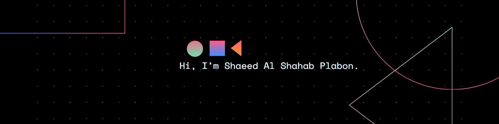

# 💫 About Me:
Hi there! I'm **Plabon** — a passionate Full-Stack Web Developer.    
🔧 I specialize in building responsive and user-friendly web applications using the **MERN Stack** (MongoDB, Express.js, React, Node.js).    
🚀 **Currently:**  
- Preparing for web development job opportunities and sharpening my skills.

---

## 📫 Connect with Me:

---

## 💻 Tech Stack:

---

## 📊 GitHub Stats:

  

  

